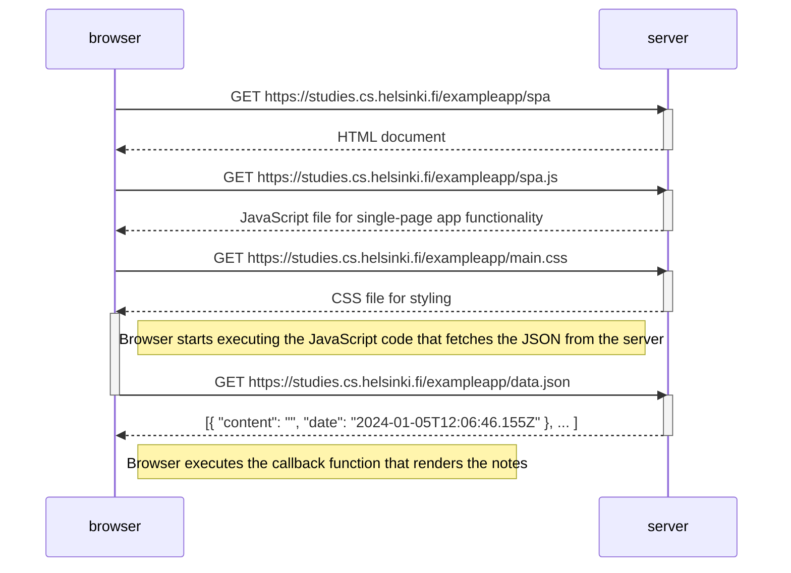

### 0.5: Single page app diagram
The following sequence diagram depicts the situation where the user goes to the single-page app version of the notes app at https://studies.cs.helsinki.fi/exampleapp/spa.

